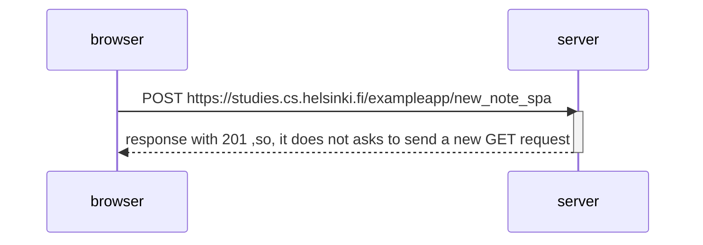

Exercise 05: New Note In Single Page Application Diagram

```mermaid
sequenceDiagram
    participant browser
    participant server

    browser->>server: POST https://studies.cs.helsinki.fi/exampleapp/new_note_spa
    activate server
    server-->>browser: response with 201 ,so, it does not asks to send a new GET request
    deactivate server
```
